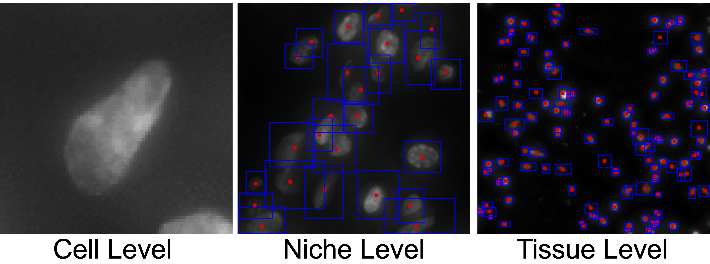

<h1 align="center">
  SPATIA: Multimodal Generation and Prediction of Spatial Cell Phenotypes
</h1>

[](https://arxiv.org/abs/2507.04704)
[](https://zitniklab.hms.harvard.edu/SPATIA/)
[]()


## 👀 Overview of SPATIA

Understanding how cellular morphology, gene expression, and spatial context jointly shape tissue function is a central challenge in biology. Image-based spatial transcriptomics technologies now provide high-resolution measurements of cell images and gene expression profiles, but existing methods typically analyze these modalities in isolation or at limited resolution. We address the problem by introducing SPATIA, a multi-level generative and predictive model that learns unified, spatially aware representations by fusing morphology, gene expression, and spatial context from the cell to the tissue level. SPATIA also incorporates a novel spatially conditioned generative framework for modeling target-state morphology distributions under observed biological transition families. Specifically, we propose a confidence-aware flow matching objective that reweights weak optimal-transport pairs based on uncertainty. We further apply morphology-profile alignment to encourage biologically meaningful image generation, enabling the modeling of microenvironment-dependent phenotypic transitions. We assembled a multi-scale dataset consisting of 25.9 million cell-gene pairs across 17 tissues. We benchmark SPATIA against 18 models across 12 tasks, spanning categories such as phenotype generation, annotation, clustering, gene imputation, and cross-modal prediction. SPATIA achieves improved performance over state-of-the-art models, improving generative fidelity by 8% and predictive accuracy by up to 3%.


## 🔬 Method Overview

- **Hierarchical multi-level architecture:** We introduce SPATIA, a multimodal model that integrates morphology, gene expression, and spatial coordinates through a hierarchical attention design. It aggregates information from local cellular neighborhoods to global tissue structure, explicitly capturing spatial context at multiple levels.
- **Spatially conditioned generative modeling:** We develop a conditional flow-matching module for modeling morphology changes under perturbations, conditioned on both intrinsic cell states and extrinsic spatial niches. Using optimal transport to align distributions, we simulate realistic phenotypic transitions (e.g., DCIS to invasive) without requiring paired pre-post perturbation data.
- **Large-Scale Benchmarking:** We validate SPATIA on MIST, a curated assembly of 25.9M cells from 74 sources. Experiments on 12 predictive and generative tasks demonstrate that SPATIA outperforms 18 existing models, improving generative fidelity by 8% over state-of-the-art models and yielding predictive gains of up to 3% in zero-shot transfer and biomarker classification.




## 📊 Results


## 🚀 Installation

Clone the GitHub repository and set up the environment.

```bash
git clone https://github.com/mims-harvard/SPATIA
cd SPATIA
```

```bash
# TODO: update with the final environment file
conda env create -f environment.yaml
conda activate SPATIA
```

## 💡 How to train SPATIA?

<!-- TODO: replace with final data download links and training commands -->
To train SPATIA, please first download the MIST dataset to `data/MIST/` and then run:

```bash
# placeholder
python train.py --config configs/train.yaml
```

## 🛠️ How to use SPATIA?

We provide scripts for predictive and generative tasks covered in the paper.

### 🔮 Phenotype generation

```bash
# placeholder
python generate.py --checkpoint path/to/checkpoint --output outputs/
```

### 🧬 Cross-modal prediction & annotation

```bash
# placeholder
python predict.py --checkpoint path/to/checkpoint --task annotation
```

### 📈 Benchmarking

```bash
# placeholder
python benchmark.py --config configs/benchmark.yaml
```

For detailed task definitions and evaluation protocols, please refer to the [project page](https://zitniklab.hms.harvard.edu/SPATIA/) and the paper.

## Citation

```bibtex
@inproceedings{kong2026spatia,
  title={Spatia: Multimodal model for prediction and generation of spatial cell phenotypes},
  author={Kong, Zhenglun and Qiu, Mufan and Boesen, John and Lin, Xiang and Yun, Sukwon and Chen, Tianlong and Kellis, Manolis and Zitnik, Marinka},
  journal={ArXiv},
  pages={arXiv--2507},
  year={2025}
}
```

## Contact

If you have any questions or suggestions, please email [Zhenglun Kong](mailto:zhenglun_kong@hms.harvard.edu).
